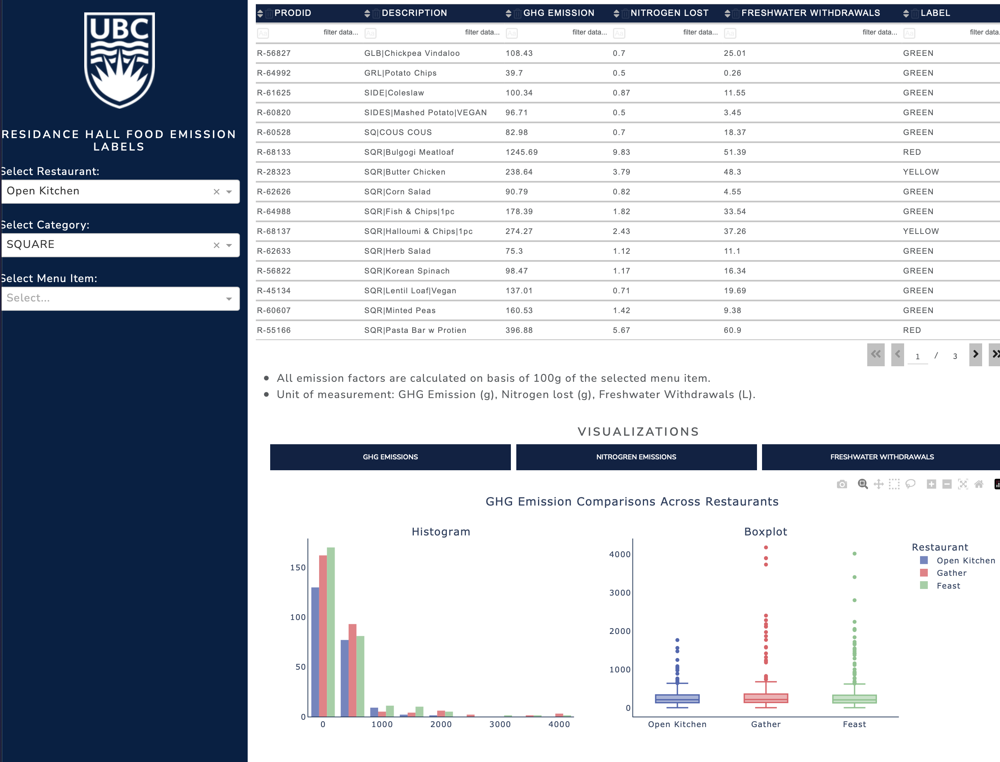

# UBC Food Services (2022~2023)

#### Credits:
- **Product recipes** provided by: University of British Columbia Food Services
- **Workflow generation** and **data analysis**: CFFS Data Analyst, Jenny Lee
- **Supervised** by: Kushank Bajaj

#### Contents:
0. Research Background and Rationale
1. Explaining Workflow
2. Final Outcomes
3. CFFS Application (Web-browser-based)

---

## 0. Research Background and Rationale
🔗 [Presentation Slides](https://github.com/jlee2843/CFFS-22-23/blob/main/UBCFS/final_presentation.pdf)
 🔗 Research Report
- **Purpose**: Adhering to UBC’s commitment to the *CAP 2030*, the CFFS project aims to achieve 50% GHG emission reduction by 2030 in comparison to 2019. 
- **Goals**: To develop a campus-wide Climate-Friendly Food Systems (CFFS) Label and observe consumer responses corresponding the labels. Ultimately aims to increase sustainable dietary choices and habits. 
- **Objectives**: Develop a semi-automatic flow that assigns CFFS labels based on the environmental impact of producing the item. 

This research consists of adaption and modification of Silvia Huang’s pilot project, which was successful in assigning food labels at the Open Kitchen, Gather, and Mercente from 2019 to 2021 Summer. **Calculation metrics**, such as *impact baseline* for considered factors, are developed by Silvia’s team in 2021 and are continued to be used for this study.

## 1. Explaining Workflow

All functions will automatically run when you run the `main.py` script. You do **not** have to run each scripts separately. 

**Files used in this workflow:**
- `Step1_data_preprocessing.py`: Raw recipe data are collected from Optimum Control in XML format. Ingredients, items, products, preps, and conversion factors included in the raw data are cleaned and processed into CSV format. 
- `Step2_data_cleaning.py`: Checks whether all ingredients are measured in standard unit. Non-standard unit measurements are processed to convert them into standard units. 
- `Step3_update_and_mapping.py`: Prior to running the script, manually assing Category IDs for each ingredient. Maps each ingredient with emission factors (emission factor information is derived from the [Cool Food Calculator](https://coolfood.org).)
- `Step4_data_analysis.py`: Computes impact values for all ingredients, and collect them by corresponding product. (*e.g.*, Impact values for bread, ham, lettuce are assigned, and impact value as a "Sandwhich" is calculated.)
- `Step5_data_labelling.py`: Automatically labels all food items into one of the three color labels: Green, Yellow, Red. Generates visualizations. 
- `Step7_visualizations.py`: Generates summary visualizations for all three residance dining halls. 

 **Manual Processes:**
- Change *file path* to a specific restaurant at `Step1_data_preprocessing.py`, line 8.
- Change *file name* to a specific restaurant at `main.py`, line 14.
- Prior to running script 3, if you have any item with an unassigned Category ID, you will run into an error. Go back and check if all items have their Category IDs assigned.
- Change *menu list* to a specific restaurant at `main.py`, line 147.

## 2. Final Outcomes

In total, **775 menu items** are labelled. Label count distributions are as following:

| Label        | Gather       | Feast  | Open Kitchen | Total |
| -------------: |-------------:| -----:| -----:| -----:| 
| Red      | 68 | 70 | 58 | 196 |
| Yellow      | 81 | 79 | 53 | 233 |
| Green      | 127 | 131 | 88 | 346 |
| Total | 276      | 280 | 219 | 775 |

#### Summary Visualizations:

Scirpts for the above figures can be found in `Step7_visualizations.py`. 

## 3. CFFS Application (Web browser)

🔗 [CFFS Application](https://cffs-app.herokuapp.com)
🔗 [Heroku demployemnt link](https://dash.plotly.com/deployment)

Accessibility to the sustainability label information is largely enhanced through development of a web-browser-based application. This application is fully developed in Python and launched with Heroku application platform. In this application, users are able to:

- Search by restaurant and category
- Search for single menu item
- Perform advanced search with keywords and conditions (*e.g.*, “GHG Emission” > 10.0 g)
- Visualize GHG emission, nitrogen, and water withdrawal footprint distributions by restaurants

The application will be active until March 2023, unless further management options are discussed. It will open on the user’s primary browser. Scirpts for the above figures can be found in `Step6_Dash_App.py.`

**<red>Warning:**</red>
 This application can only be updated by the original author. Updating the script will **not** automatically update the app.
